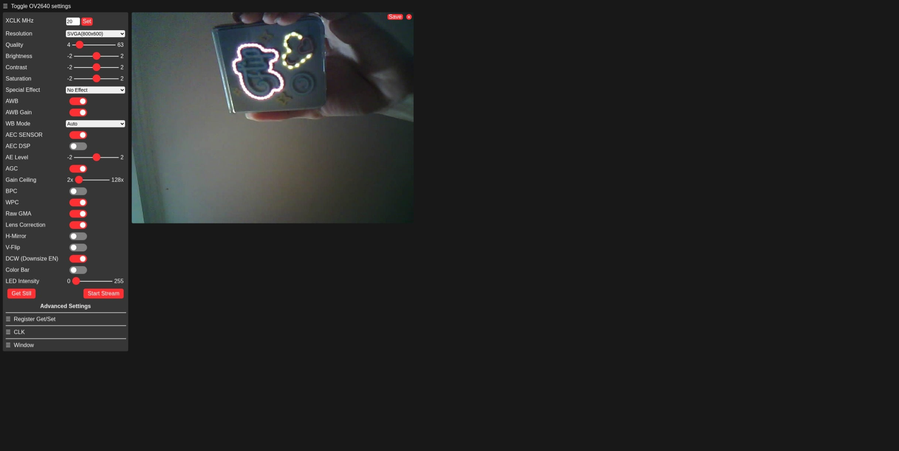

# ESP32-CAM Camera Web Server

Stolen from [arduino-esp32 library examples](https://github.com/espressif/arduino-esp32/tree/master/libraries/ESP32/examples/Camera/CameraWebServer)

## Prerequisites

1. Install `arduino-cli`
   ```sh
   curl -LO https://github.com/arduino/arduino-cli/releases/download/v1.4.1/arduino-cli_1.4.1-1_amd64.deb
   sudo dpkg -i arduino-cli_1.4.1-1_amd64.deb
   ```
2. Add esp32 boards to board_manager:
   ```yaml
   # ~/.arduino15/arduino-cli.yaml
   board_manager:
     additional_urls:
       - https://raw.githubusercontent.com/espressif/arduino-esp32/gh-pages/package_esp32_index.json
   ```
3. Install the esp32 core
   ```sh
   arduino-cli core update-index
   arduino-cli core install esp32:esp32
   ```

Check core and boards:

```console
$ arduino-cli core list
ID          Installed Latest Name
arduino:avr 1.8.7     1.8.7  Arduino AVR Boards
esp32:esp32 3.3.7     3.3.7  esp32

$ arduino-cli board list
Port         Protocol Type              Board Name FQBN Core
/dev/ttyUSB0 serial   Serial Port (USB) Unknown
```

## Compile

```sh
arduino-cli compile --fqbn esp32:esp32:esp32cam .
```

```console
$ arduino-cli compile --fqbn esp32:esp32:esp32cam .
In file included from /home/michael/.arduino15/packages/esp32/tools/esp32-libs/3.3.7/include/bt/include/esp32/include/esp_bt.h:16,
                 from /home/michael/.arduino15/packages/esp32/hardware/esp32/3.3.7/cores/esp32/esp32-hal-bt.c:30:
/home/michael/.arduino15/packages/esp32/tools/esp32-libs/3.3.7/include/bt/include/esp32/include/../../../../controller/esp32/esp_bredr_cfg.h:18:9: note: '#pragma message: BT: forcing BR/EDR max sync conn eff to 1 (Bluedroid HFP requires SCO/eSCO)'
   18 | #pragma message ("BT: forcing BR/EDR max sync conn eff to 1 (Bluedroid HFP requires SCO/eSCO)")
      |         ^~~~~~~
In file included from /home/michael/.arduino15/packages/esp32/tools/esp32-libs/3.3.7/include/bt/include/esp32/include/esp_bt.h:16,
                 from /home/michael/.arduino15/packages/esp32/hardware/esp32/3.3.7/cores/esp32/esp32-hal-misc.c:29:
/home/michael/.arduino15/packages/esp32/tools/esp32-libs/3.3.7/include/bt/include/esp32/include/../../../../controller/esp32/esp_bredr_cfg.h:18:9: note: '#pragma message: BT: forcing BR/EDR max sync conn eff to 1 (Bluedroid HFP requires SCO/eSCO)'
   18 | #pragma message ("BT: forcing BR/EDR max sync conn eff to 1 (Bluedroid HFP requires SCO/eSCO)")
      |         ^~~~~~~
Sketch uses 1069805 bytes (34%) of program storage space. Maximum is 3145728 bytes.
Global variables use 69432 bytes (21%) of dynamic memory, leaving 258248 bytes for local variables. Maximum is 327680 bytes.
```

The build artifacts is at `~/.cache/arduino/sketches/*/CameraWebServer.ino.bin`

## Flash

```sh
arduino-cli upload -p /dev/ttyUSB0 --fqbn esp32:esp32:esp32cam .
```

```console
$ arduino-cli upload -p /dev/ttyUSB0 --fqbn esp32:esp32:esp32cam .
esptool v5.1.0
Connected to ESP32 on /dev/ttyUSB0:
Chip type:          ESP32-D0WD-V3 (revision v3.1)
Features:           Wi-Fi, BT, Dual Core + LP Core, 240MHz, Vref calibration in eFuse, Coding Scheme None
Crystal frequency:  40MHz
MAC:                08:d1:f9:39:0e:b4

Stub flasher running.
Changing baud rate to 460800...
Changed.

Configuring flash size...
Flash will be erased from 0x00001000 to 0x00007fff...
Flash will be erased from 0x00008000 to 0x00008fff...
Flash will be erased from 0x0000e000 to 0x0000ffff...
Flash will be erased from 0x00010000 to 0x00115fff...
Wrote 25024 bytes (16034 compressed) at 0x00001000 in 0.6 seconds (311.5 kbit/s).
Hash of data verified.
Wrote 3072 bytes (134 compressed) at 0x00008000 in 0.0 seconds (656.8 kbit/s).
Hash of data verified.
Wrote 8192 bytes (47 compressed) at 0x0000e000 in 0.1 seconds (930.2 kbit/s).
Hash of data verified.
Wrote 1069952 bytes (689993 compressed) at 0x00010000 in 16.8 seconds (508.8 kbit/s).
Hash of data verified.

Hard resetting via RTS pin...
New upload port: /dev/ttyUSB0 (serial)
```

## Test it

- Might need to press the Reset (RST) button
- Open the IP of the camera

```sh
xdg-open http://192.168.1.6
```



## References

- [lastminuteengineers](https://lastminuteengineers.com/getting-started-with-esp32-cam/)
- [arduino-cli](https://docs.arduino.cc/arduino-cli/getting-started/)
